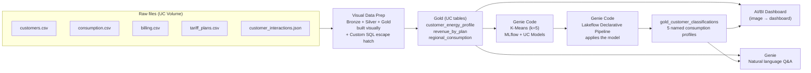

# Retail Energy — Databricks Visual Data Prep + Genie Code Demo

A complete, end-to-end **45-minute Databricks workshop** built on synthetic French retail-energy data. Clone the repo, run one Python script against your own Databricks workspace, then walk a panel through a flow that takes raw smart-meter files all the way to an ML-powered AI/BI dashboard — combining the **visual canvas of Visual Data Prep** with the **generative power of Genie Code**.

> **Outcome promise:** in 40 minutes, you go from 5 raw files (CSV + nested JSON) to a named, quantified upsell list (the "Night Owl" customers) — built with **Visual Data Prep**, **MLflow + Unity Catalog**, **Lakeflow Declarative Pipelines**, **AI/BI Dashboards**, and **Genie**.

---

## Architecture



Visual Data Prep builds the medallion live on a canvas. Genie Code then takes over for the generative work: training the model, scaffolding the declarative pipeline that applies it, and authoring the dashboard from an image.

---

## Prerequisites

| Requirement | Notes |
|---|---|
| **Databricks workspace** | Unity Catalog enabled, **serverless compute** available (DBR + SQL warehouses) |
| **Catalog rights** | `CREATE SCHEMA`, `CREATE VOLUME`, `CREATE TABLE`, `CREATE MODEL` on a target catalog |
| **Databricks CLI** | Installed and a profile configured in `~/.databrickscfg` |
| **Python 3.10+** | With `polars`, `mimesis`, `numpy`, `databricks-sdk` |
| **Node 18+** | Only if you want to run the optional presentation web-app |

```bash
pip install polars mimesis numpy databricks-sdk
```

---

## Quickstart in 3 commands

```bash
# 1. Clone
git clone https://github.com/AlexPicard10/retail-energy-genie-code-demo.git
cd retail-energy-genie-code-demo

# 2. Generate synthetic data and upload to your workspace
python3 02_Setup/energy_retail_demo_setup.py \
    --profile <YOUR_PROFILE> \
    --catalog <YOUR_CATALOG>

# 3. Open Databricks and start with Visual Data Prep (Pillar 1),
#    then switch to Genie Code from Pillar 2 onward.
#    Full script: 01_Scenario/ENERGY_RETAIL_DEMO_GUIDE_EN.md
```

Replace `<YOUR_PROFILE>` with a CLI profile name (e.g. `my-workspace`) and `<YOUR_CATALOG>` with the Unity Catalog you have rights on (e.g. `main`, `dev_sandbox`). The script creates a schema `energy_retail_demo`, a UC volume `raw_data`, and uploads:

- `raw_customers.csv` — 5,000 customers with anomaly flags, churn-risk score, EV / solar / household-size enrichment
- `raw_consumption.csv` — ~640k smart-meter readings (daily + weekly + hourly samples), with realistic spike / flatline anomalies on ~5% of customers
- `raw_billing.csv` — 60,000 monthly bills
- `raw_tariff_plans.csv` — 10 tariff plans (regulated, fixed, indexed, green)
- `raw_customer_interactions.json` — 15,000 nested-JSON support interactions (3 levels deep)

Useful flags:
- `--check` — verify state without creating any resources
- `--teardown` — remove pipelines, dashboards, MLflow models, and bronze/silver/gold tables (preserves the raw files)

---

## The demo (45 minutes)

The full script lives in **[01_Scenario/ENERGY_RETAIL_DEMO_GUIDE_EN.md](01_Scenario/ENERGY_RETAIL_DEMO_GUIDE_EN.md)**. Drive Visual Data Prep for Pillar 1, then copy each Genie Code prompt for Pillars 2 and 3 in order.

| # | Pillar | Time | Tool | What lands |
|---|--------|------|------|-----------|
| Intro | — | 3 min | — | The "villain" hook + why the next 40 minutes matter |
| 1 | Data Engineering | 4 min | **Visual Data Prep** | Explore the 5 raw files on the canvas — plant the anomaly mystery |
| 2 | Data Engineering | 4 min | **Visual Data Prep** | Bronze flow with built-in data-quality rules |
| 3 | Data Engineering | 4 min | **Visual Data Prep** | Silver — visual joins + Custom SQL node for nested JSON |
| 4 | Data Engineering | 3 min | **Visual Data Prep** | Gold business marts (customer profile, revenue, regional) |
| 5 | Data Science | 7 min | **Genie Code** | Train K-Means (k=5) in a notebook, register in Unity Catalog |
| 6 | Data Science | 5 min | **Genie Code** | Build a *new* Lakeflow pipeline that applies the model |
| 7 | Analytics | 5 min | **Genie Code** | **Image → dashboard** in 30 seconds (AI/BI from a hand-drawn mockup) |
| 8 | Analytics | 5 min | **Genie** | Q&A leading with the Night Owl upsell list, ends with anomaly hunting |
| 9 | Analytics | 3 min | **Genie Code** | Enrich the dashboard with the 5 ML profiles |

Visual aids live in [03_Visuels/](03_Visuels/) — keep `Retails_Energy_Dashboard.png` handy as the input mockup for prompt 7.

---

## Optional — run the presentation web-app

A standalone React/Vite slide deck companion designed to run on your laptop next to the live workspace. It walks an audience through the architecture, the 8 prompts (with copy buttons), the 5 customer profiles (animated K-Means reveal), and a Genie chat preview.

```bash
cd web-app
npm install
npm run dev
# open http://localhost:5173
```

Slide navigation: **← / →** or **PageUp / PageDown** to step through, **Home / End** to jump, **Space** to advance.

The web-app is a pure static presentation — it does not connect to your Databricks workspace. All data shown is illustrative. See [web-app/README.md](web-app/README.md) for stack details.

---

## Teardown

After the demo, clear the derived artifacts (the classification pipeline, dashboard, MLflow model, bronze/silver/gold tables) — the schema, volume, and raw files are preserved so you can re-run the demo without regenerating data:

```bash
python3 02_Setup/energy_retail_demo_setup.py \
    --profile <YOUR_PROFILE> \
    --catalog <YOUR_CATALOG> \
    --teardown
```

The Visual Data Prep flow built in Pillar 1 must be deleted manually from the workspace UI (no SDK teardown path yet) — the teardown script will print a reminder.

To truly start over, just re-run the setup command — it overwrites the raw files in place.

---

## Project structure

```
retail-energy-genie-code-demo/
├── README.md                                  ← this file
├── LICENSE                                    ← MIT
├── 01_Scenario/
│   └── ENERGY_RETAIL_DEMO_GUIDE_EN.md         ← full demo script (9 prompts)
├── 02_Setup/
│   └── energy_retail_demo_setup.py            ← generates + uploads synthetic data
├── 03_Visuels/
│   ├── DemoScenarioGenieCode.png              ← scenario overview slide
│   ├── Retails_Energy_Dashboard.png           ← target dashboard (Prompt 7 input)
│   ├── Databricks-Emblem.png
│   └── Databricks_Logo.png
└── web-app/                                   ← optional presentation deck
    ├── README.md
    ├── package.json
    └── src/
```

---

## Customizing the look

Want to rebrand the deck for a specific customer? Three places to edit:

1. **[web-app/tailwind.config.js](web-app/tailwind.config.js)** — color palette (the `engie.*` tokens are kept as a starting point; rename or recolor freely).
2. **[web-app/src/components/Logo.tsx](web-app/src/components/Logo.tsx)** — `DatabricksMark` and `GenieMark` SVGs. Add a customer mark here if you want one in the brand row of [Hero.tsx](web-app/src/sections/Hero.tsx).
3. **[01_Scenario/ENERGY_RETAIL_DEMO_GUIDE_EN.md](01_Scenario/ENERGY_RETAIL_DEMO_GUIDE_EN.md)** — the intro "villain" hook is currently written for a generic French retail energy team; rewrite it to fit the customer's situation.

**Note:** [03_Visuels/DemoScenarioGenieCode.png](03_Visuels/DemoScenarioGenieCode.png) still depicts the old Genie-Code-only flow. Regenerate it (e.g., screenshot the updated DemoScenario section of the web-app, or redraw it) so the diagram matches the new Visual Data Prep + Genie Code split.

---

## License

MIT — see [LICENSE](LICENSE).

---

## Disclaimer

All data generated by [02_Setup/energy_retail_demo_setup.py](02_Setup/energy_retail_demo_setup.py) is **synthetic**. Names, addresses, consumption, and interactions are produced by [Mimesis](https://mimesis.name/) + numpy and bear no relation to any real customer. This package is provided as-is for Databricks demo purposes and is not affiliated with any specific energy retailer.
